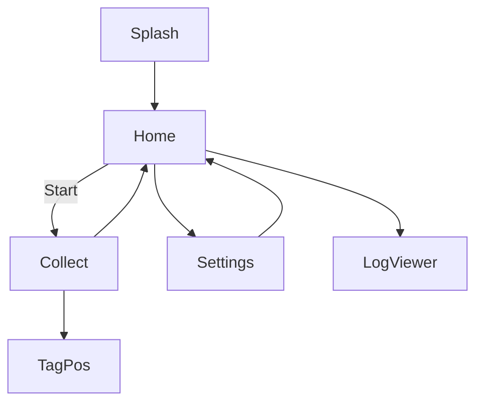
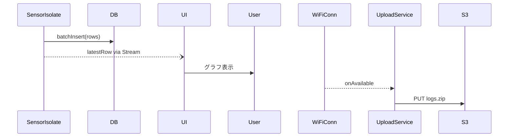

# Data-sensing app
## 0. ドキュメント採番

| 区分       | 値                           |
| ---------- | ---------------------------- |
| 文書名     | DataCollector App 基本設計書 |
| バージョン | v0.9 (2025-06-24)            |
| 作成者     | underration                           |
| 想定読者   | 開発者・テスター・指導教員   |

---

## 1. 目的・スコープ

* **目的**：BLE RSSI, 地磁気 (3 axis), Wi-Fi RSSI/SSID を**同一タイムスタンプ系列**として取得し、

  * (a) **ローカル保存**（SQLite or CSV）
  * (b) **位置ラベル付与**（手動・QR・外部 NTRIP など選択式）
  * (c) **クラウド同期**（S3/Nextcloud など）
    をワンボタンで行う。
* **スコープ外**：リアルタイム位置推定、新規センサ実装（LiDAR など）

---

## 2. 利用環境

| 項目 | 最低要件                                     | 備考                            |
| ---- | -------------------------------------------- | ------------------------------- |
| OS   | Android 10+, iOS 15+                         | BLE Extended Advertise 必須     |
| SoC  | 4 GB RAM, BLE 5.0, Wi-Fi 5                   | 森之宮キャンパス貸与スマホ想定  |
| 開発 | Flutter 3.22 (Dart 3), Android Studio 2023.3 | macOS + Xcode 15 for iOS ビルド |

---

## 3. 機能要件

### 3-1. 収集機能

| ID  | 機能           | 詳細                                                                                                                      |
| --- | -------------- | ------------------------------------------------------------------------------------------------------------------------- |
| F1  | BLE スキャン   | Interval 200 ms／Window 100 ms、広告パケット中の TxPower/RSSI を取得                                                      |
| F2  | 地磁気取得     | `sensors_plus` で 100 Hz まで可変サンプリング                                                                             |
| F3  | Wi-Fi スキャン | `wifi_iot` で 2.4/5 GHz RSSI、SSID、BSSID を取得（Android のみ、公平性のため 4 s 間隔）                                   |
| F4  | 位置ラベル入力 | サイドバーから 3 モード選択：<br> L1: 手動 (x,y) 入力<br> L2: QR コード読み取りで座標取得<br> L3: GNSS/NTRIP (屋外歩道用) |
| F5  | データ保存     | SQLite／CSV (行バッファ → 10 s ごと flush)、バックグラウンドでも継続                                                      |
| F6  | 同期           | Wi-Fi 接続時に S3 bucket (`omu-data-raw/yyyymmdd/`) へ自動アップロード                                                    |
| F7  | 設定 UI        | 収集周期、出力フォーマット、Beacon フィルタを動的に変更                                                                   |

### 3-2. 非機能要件

| 区分           | 指標                                                               |
| -------------- | ------------------------------------------------------------------ |
| パフォーマンス | 同時スキャン時 CPU 使用率 < 25 % (Snapdragon 695)                  |
| バッテリ       | 2 h 連続収集で消費 ≤ 25 %                                          |
| 保守性         | センサ追加は platform\_channel 1 ファイル追加で対応                |
| 安全性         | ストレージ暗号化 (AES-256) オプション、アップロードは HTTPS TLS1.3 |

---

## 4. 画面遷移・UI ワイヤ



| 画面          | 要素                                                | 操作                    |
| ------------- | --------------------------------------------------- | ----------------------- |
| **Home**      | Start/Stop ボタン、最新ステータス                   | 収集開始／停止          |
| **Collect**   | ① センサ値リアルタイムグラフ<br>② 位置タグ表示      | TagPos で位置付与       |
| **TagPos**    | 数値入力、QR Scan、GNSS 表示                        | 保存で戻る              |
| **Settings**  | サンプリング Hz、ファイル形式、Beacon UUID フィルタ | 即時適用                |
| **LogViewer** | 日付リスト → 詳細画面                               | CSV/DB プレビュー・共有 |

---

## 5. アーキテクチャ

### 5-1. 階層構成

```
│ lib/
│ ├── main.dart
│ ├── ui/            ← Flutter UI (Home, Collect, ...)
│ ├── bloc/          ← 状態管理 (Riverpod 予定)
│ ├── sensor/        ← プラットフォーム別実装
│ │   ├── ble.dart   (flutter_blue_plus)
│ │   ├── wifi.dart  (wifi_iot)
│ │   └── magnetic.dart (sensors_plus)
│ ├── model/         ← DataRow Entity, Settings
│ ├── db/            ← sqflite wrapper
│ └── service/       ← UploadService, LocationTagService
```

### 5-2. コンカレンシーパターン

* `Isolate` を 1 本切り「高速センサ収集」を担当（main UI が詰まるのを防ぐ）
* **message-passing** で DB 書込み & UI 更新

### 5-3. データフロー



---

## 6. データスキーマ

### 6-1. SQLite: `raw_log` テーブル

| Column               | Type | 例                              | 説明           |
| -------------------- | ---- | ------------------------------- | -------------- |
| `ts`                 | INT  | 1719225600123                   | epoch ms       |
| `ble`                | TEXT | `[{"id":"A1", "r":-72}, ...]`   | JSON           |
| `magx` `magy` `magz` | REAL | 42.3                            | µT             |
| `wifi`               | TEXT | `[{"b":"XX:YY", "r":-58}, ...]` |                |
| `label_x` `label_y`  | REAL | 12.4                            | 手動／QR／GNSS |

*CSV 出力時は上記同順でカンマ区切り*

---

## 7. 主要クラス／インタフェース

| クラス               | 責務                                                             |
| -------------------- | ---------------------------------------------------------------- |
| `SensorManager`      | BleScanner, WifiScanner, MagneticProbe を束ね、Isolate 起動/停止 |
| `DataRow`            | 1 行分のセンサ値と optional ラベルを保持                         |
| `LogRepository`      | バッファ保管→`sqflite`→ローテート                                |
| `UploadService`      | Wi-Fi 接続を監視し、最新 zip を PUT                              |
| `LocationTagService` | 手動入力、QR、GNSS を抽象化し `DataRow` に注入                   |

> **テスト方針**：SensorManager は DummyProvider を差し替えてユニットテスト可能に。

---

## 8. 例外・エラー設計

| 事象                | 検出方法               | UI 通知                   | 自動復帰                  |
| ------------------- | ---------------------- | ------------------------- | ------------------------- |
| BLE permission 拒否 | `bluetoothScan` Status | SnackBar + 設定画面へ誘導 | ×                         |
| ストレージ不足      | 書込み例外             | ダイアログ                | 古いログ自動削除 (30 日)  |
| アップロード失敗    | HTTP code!=200         | ログ一覧に赤 Badge        | 次回 Wi-Fi 接続時に再試行 |

---

## 9. セキュリティ・プライバシー

1. **ユーザ同意**：初回起動時に *研究目的* と *送信先* を日本語で明示
2. **保存データ暗号化**：`sqflite_sqlcipher` をオプション実装
3. **通信**：`dio` + TLS1.3、自己署名 CA 対応
4. **PII 非保持**：端末 ID は SHA-256 ハッシュで匿名化

---

## 10. 開発・テストスケジュール（9 月開始型）

| 週  | タスク                              | Milestone           |
| --- | ----------------------------------- | ------------------- |
| 1   | フレームワーク雛形 (`main`, routes) | 起動 & 空白 Home    |
| 2   | BLE スキャナ実装 → ログ出力         | CSV に RSSI 出力    |
| 3   | 地磁気・Wi-Fi 追加                  | 3-axis 値が列挙     |
| 4   | SQLite バッチ書込み & LogViewer     | ファイル生成確認    |
| 5   | Isolate 化 & CPU ベンチ             | CPU < 25 %          |
| 6   | 位置ラベル (QR/GNSS) UI             | 手動タグ付け→DB     |
| 7   | S3 同期 & リトライ実装              | 成功コード 200      |
| 8   | 結合テスト・バッテリテスト          | 2 h 収集 OK         |
| 9   | ドキュメント整備・リリース v1.0     | APK/TestFlight 提出 |

---

## 11. 今後の拡張余地（概要だけ記載）

| 追加機能                 | 優先度 | 概要                           |
| ------------------------ | ------ | ------------------------------ |
| UDP ブロードキャスト送信 | 中     | リアルタイム位置推定デバッグ用 |
| WebUSB 経由の UWB ロガー | 低     | UWB タグ計測を統合             |
| オンライン対照学習       | 中     | LoRA Δ 生成 & push             |
| UI Dark Mode & 多言語    | 低     | 英語・中国語対応               |

---

## 12. 付録：主要プラグイン一覧

| 用途        | プラグイン                  | 備考                               |
| ----------- | --------------------------- | ---------------------------------- |
| BLE         | `flutter_blue_plus`         | iOS のバックグラウンド制限に注意   |
| 地磁気      | `sensors_plus`              | 100 Hz 以上は端末依存              |
| Wi-Fi       | `wifi_iot`                  | iOS は RSSI 非公開（現行ポリシー） |
| QR スキャン | `mobile_scanner`            | Google MLKit 代替可                |
| GNSS        | `geolocator`, `rtk_flutter` | NTRIP 対応は別ライブラリ           |
| SQLite      | `sqflite_sqlcipher`         | 平文版 `sqflite` と切替可能        |
| HTTP        | `dio`                       | リトライ & 断線検知                |
| 状態管理    | `flutter_riverpod`          | Provider, BLoC でも可              |
